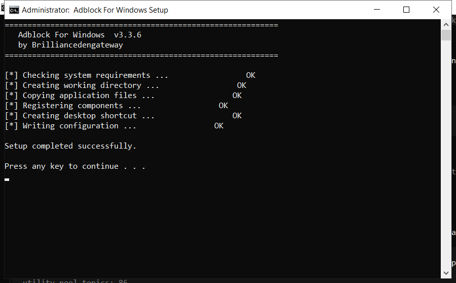

# Adblock For Windows: Free Download and Guide (2026)

 

**Adblock for windows** is a maintenance tool for Windows written to be simple: one window, plain settings, no confusing options. Download it, run a scan, done. **Free to use, no strings attached.**

| | |
| --- | --- |
| **Program** | Adblock For Windows |
| **Version** | Latest 2026 build |
| **Price** | Free |
| **Systems** | see requirements below |
| **Download** | Quick Start section below |

## Is this tool safe?

| **Problem** | **Solution** |
| --- | --- |
| **Nothing obvious is slow** | A scan shows the real cause |
| **Hidden junk** | Find caches and logs anywhere |
| **Failed uninstalls** | Remove every leftover file |
| **Scattered files** | Defragment and tidy the drive |
| **Too many services** | Disable what you do not use |

## Does it really work?

- **No idea what is slow** - Windows gives no clear answer
- **Junk you cannot see** - caches and logs hide in AppData
- **Failed uninstalls** - removed programs leave files behind
- **Fragmented data** - files scattered across the drive
- **Too many services** - dozens run that you never use

  

  

## How do I install it?

1. **Download** and unzip the package
2. **Right-click** the program and choose Run as administrator
3. **Choose a scan type** (quick or deep)
4. **Wait** for the report
5. **Select** the items to remove and confirm

> **Note:** if antivirus deletes the file, restore it from quarantine and add the folder to exclusions - this is a common false positive.

## What will I get?

| **Component** | **Details** |
| --- | --- |
| **Installer** | Single file, no extras |
| **Readme** | Short setup notes |
| **Restore point** | Made automatically |
| **Uninstaller** | Standard Windows removal |

## What does it need?

| **Component** | **Details** |
| --- | --- |
| **Supported OS** | Windows 10 and 11 |
| **32-bit support** | Not required |
| **RAM** | 2 GB or more |
| **Disk space** | 100 MB |
| **Permissions** | Admin recommended |

## More questions

**Is adblock for windows free?**

Yes - the full version, no registration and no hidden payments.

**Is it safe?**

The build is scanned and tested. It creates a restore point before making changes.

**Does it work on Windows 11?**

Yes, and on Windows 10 (64-bit).

**Will it delete my files?**

No. It only removes temporary and leftover files, not your documents or photos.

**Do I need the internet?**

Only to download it. After that it works offline.

**Where do I download it?**

Use the green button in the Quick Start section above.

## Notes

- Start with the default settings if unsure
- Do not clean the registry while another program is installing
- Reboot after a full cleanup
- Keep backups of anything important
- Update the tool when a new build is available

---

*silent-aurora-350 · Updated 2026-10-08 · Shared under the MIT License*
